# AgroSyntech - Funcional DashBoard

#### * Este documento apresenta uma abordagem não técnica e sem discussão dos dados, apenas apresenta o projeto desenvolvido. 

## RESULTADO OBTIDO - ABORDAGEM 'TOUR'

Ao final da etapa de preparação do ambiente virtual, teste de conexão e confirmação do acesso aos dados, deu-se início ao processo de desenvolvimento.

Para concepção do sistema, foi pensada uma apresentação em 2 etapas: uma land-page agradável, simples e intuitiva; e o perfil analítico de cada proprietário, onde os dados são interpretados, tratados e exibidos de forma intuitiva e funcional.

### LAND PAGE
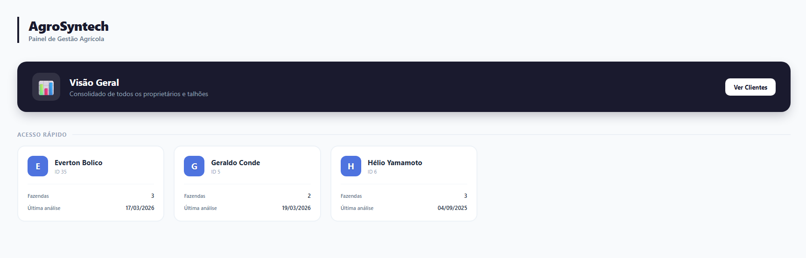

A interface busca ser simples e de fácil entendimento sobre seu funcionamento.

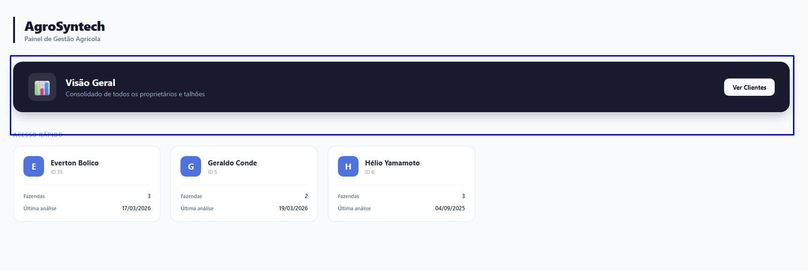

A área demarcada pelo retângulo azul é a `Visão Geral`. Nesta tela, é possível ver a lista de todos os proprietários clientes ativos e informações básicas a respeito dos mesmos:

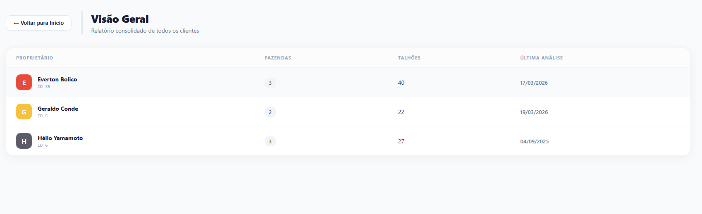

Uma vez nesta tela, ao clicar sobre qualquer cliente ativo, o usuário é levado à sua tela individual.

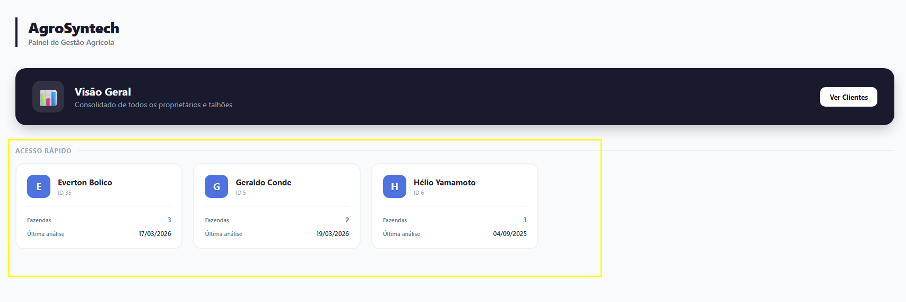

De volta à Home page, a área amarela é responsável por um acesso rápido. Ali, os clientes mais acessados irão aparecer já filtrados para facilitar o processo de identificação dos mesmos — direcionando diretamente para seus perfis individuais.

### PERFIL INDIVIDUAL

Ao escolher um proprietário, o usuário é redirecionado para seu `Perfil Individual`.

Essa é a visão que o usuário terá após os dados serem devidamente carregados.

No canto superior esquerdo, concentra-se um card referente ao proprietário. Lá haverá: nome, situação, membro_desde e sua `Lista de Propriedades`.

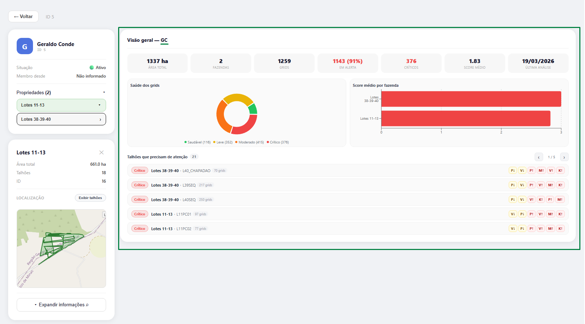

À direita, a visão geral daquele cliente: área de terras ao todo, quantidade de fazendas, quantidade de grids, quantos destes estão com índices de nutrientes abaixo do esperado, score geral de suas propriedades e a data da última coleta dos dados.

Não só isso, mas também representações gráficas simplificadas a respeito da qualidade dos grids (em geral).

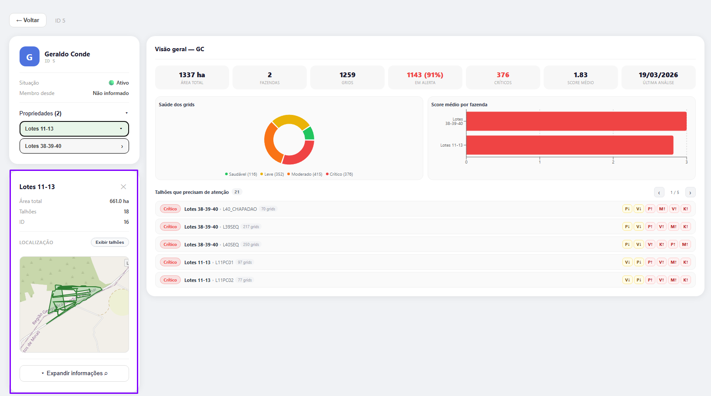

À esquerda, abaixo do card do proprietário, ao abrir o menu select de propriedades e selecionar uma das opções disponíveis, um novo card aparece abaixo. Este contém informações específicas dessa fazenda, como: área total e quantidade de talhões. Caso suas coordenadas `geom` estejam bem definidas no banco, o mapa da propriedade será exibido junto dos dados. Os talhões também devem ser visíveis nesta etapa, caso o usuário selecione a opção "Exibir Talhões":

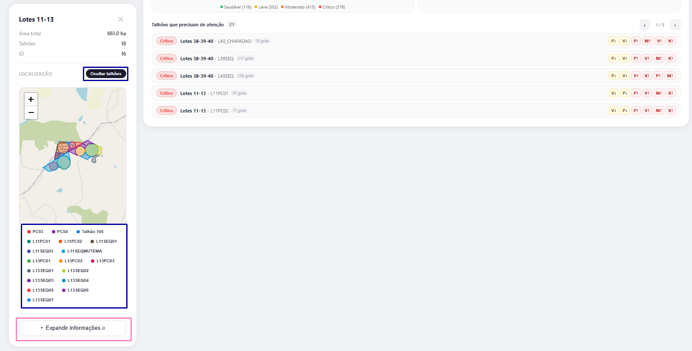

Ao selecionar o botão `Expandir Informações`, indicado pela marcação rosa, o usuário irá carregar informações completas a respeito daquela propriedade:

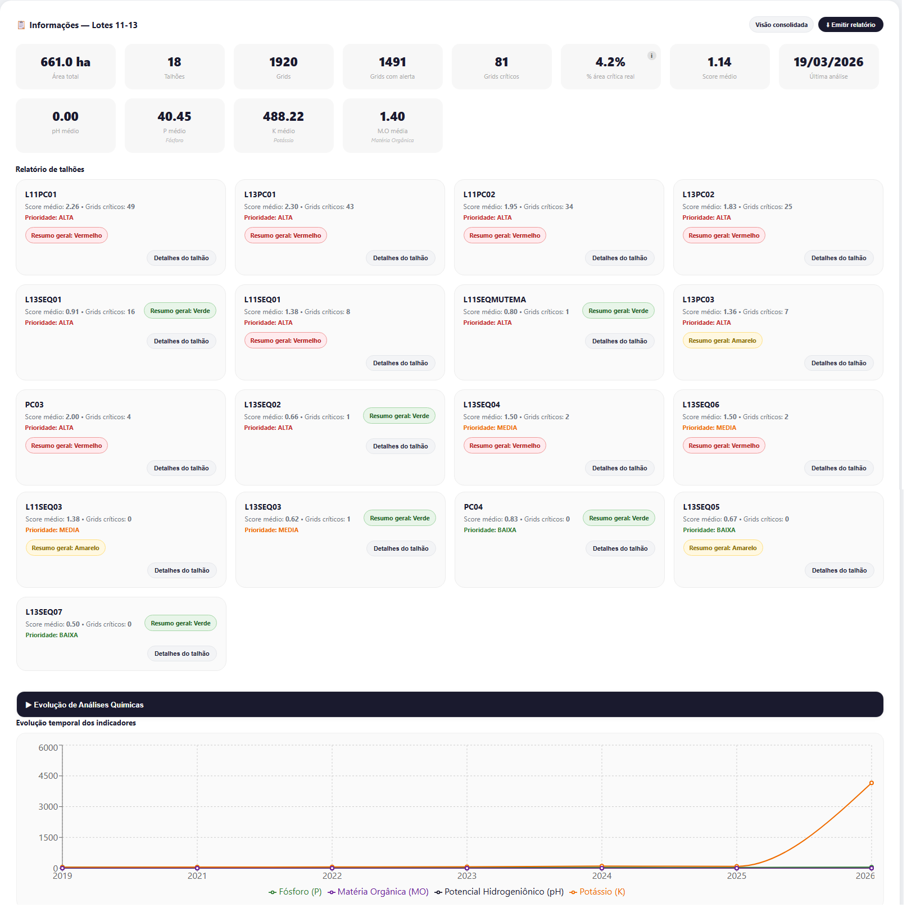

Aqui, área total, número de talhões, grids totais, grids com alerta*, grids críticos, última análise e informações completas sobre nutrientes são exibidas. Abaixo, também é carregado cada talhão dessa propriedade, os quais podem ser expandidos, tornando possível analisar o estado de cada grid individualmente.

O primeiro gráfico da propriedade também aparece agora. Este representa a evolução (aumento - diminuição) dos níveis dos nutrientes naquela propriedade ao longo dos anos. Para este, são exibidos valores referentes a Potássio (K), Fósforo (P), Matéria Orgânica (MO) e Potencial Hidrogeniônico (pH).

Na grid que exibe todos os talhões, caso o usuário abra o botão `Detalhes do Talhão`, um pop-up será exibido na tela, apresentando todos os grids daquele talhão selecionado, bem como suas informações:

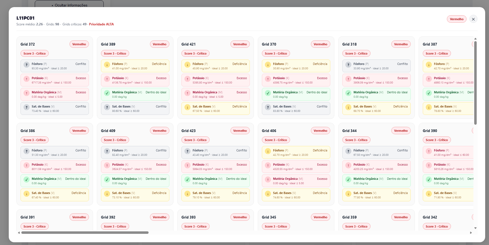

Ainda nesta tela, ao expandir o menu `Evolução de Análises Químicas`, mais representações gráficas são exibidas ao usuário:

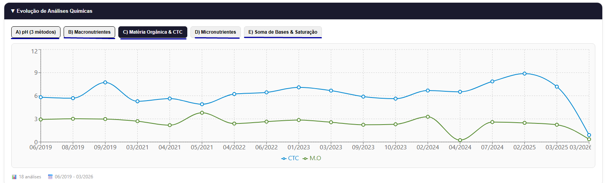

Mais abaixo na página, encontram-se os últimos indicadores, mantendo a aparência amigável e de fácil interpretação:

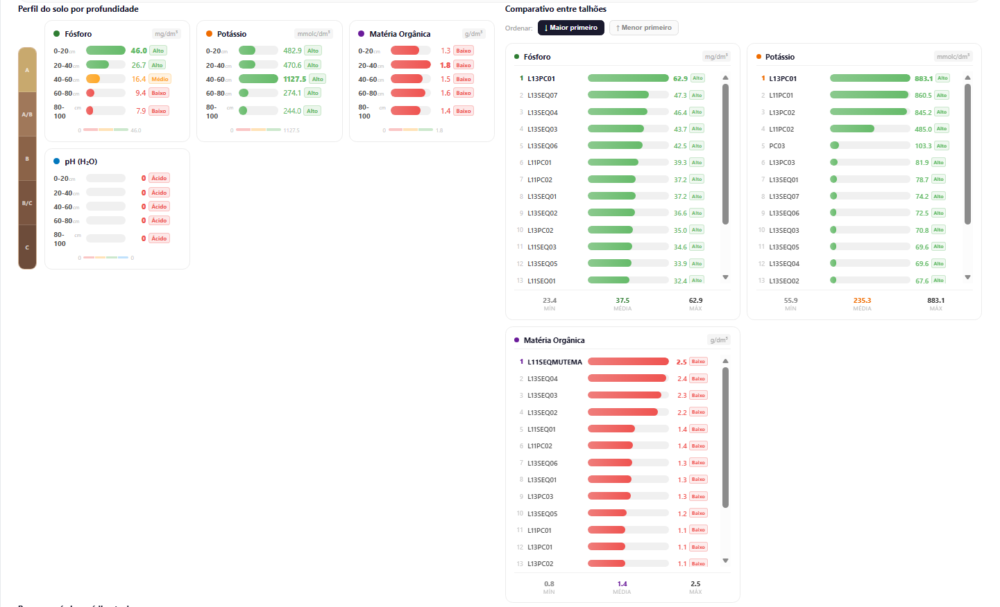

Nessa seção, os dados referentes à relação Profundidade vs Nutrientes, bem como uma comparação entre os talhões, já filtradas por nutrientes.

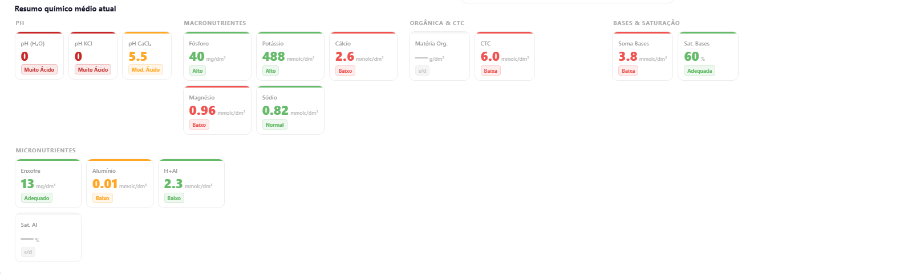

O último indicativo da página realiza um apanhado dos dados químicos gerais da propriedade.